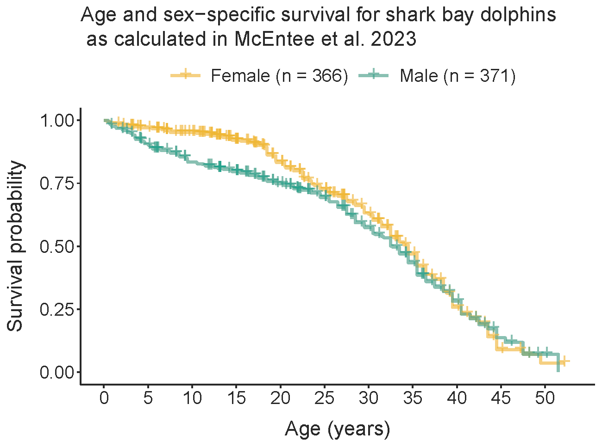

<!-- README.md is generated from README.Rmd. Please edit that file -->

```{r, include = FALSE}
knitr::opts_chunk$set(
  collapse = TRUE,
  comment = "#>",
  fig.path = "man/figures/README-",
  out.width = "75%",
  warning = FALSE,
  message = FALSE,
  fig.retina = 2,
  fig.align = 'center'
)
library(tidyverse)
library(sbdrpdata)
```

# sbdrpdata <a href='https://www.monkeymiadolphins.org'></a>

<!-- badges: start -->

[](https://doi.org/10.5281/zenodo.3960218)

<!-- badges: end -->

The goal of sbdrpdata (shark bay dolphin research project data) is to provide open access to the data collected during the ongoing long-term study of wild Indo-Pacific bottlenose dolphins (*Tursiops aduncus*) in Shark Bay, Western Australia.



To install the development version from [GitHub](https://github.com/) use:

``` r
# install.packages("remotes")
remotes::install_github("GeorgetownMannLab/sbdrpdata")
```

## About the data

Data were collated and made available by [Dr. Janet Mann](https://gufaculty360.georgetown.edu/s/contact/00336000014RY0bAAG/janet-mann) through the [Shark Bay Dolphin Research Project](www.monkeymiadolphins.org), with support from the [National Science Foundation](https://nsf.gov/). 

The sbdrpdata package contains three datasets. 

```{r showdata}
library(sbdrpdata)
data(package = 'sbdrpdata')
``` 
